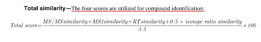
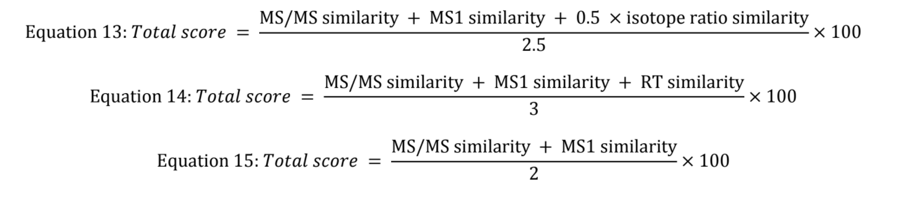
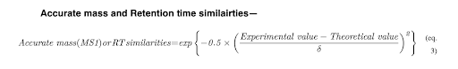

### MARS Project Log

This is an ongoing log: a place for build notes and questions.
*This is not to be confused with the Design Doc on the Shared Google Drive; that is for overall design direction and team suggestions. It is also not a README, which will be written closer to project completion.*

#### TODO: 
What is being worked on right now

- Tidy up the workflow of the mz/rt/ms2/z/column dataframe to a Confidence Level 1 annotated dataframe.
- Confirm equation for full similarity scoring.

---

#### Specific Questions

- In the original MSMScosine_1 function, the tolerance level for m.z matching is set as 0.02. Is this a good rule of thumb level?
- The MSMScosine_1 function doesn't actually call the mass1 and mass2 inputs (see code section below). Are those just a typo?
- Are the scan1 and scan2 variables I am using correct? I am inputting two mini dataframes, one of the MS2 data from the MFCluster_Assignments sheet, and the other from the standards MS2 sheet. Each mini dataframe is two columns, the first "mz" and the second "intensity". I'm getting errors that I can fix but maybe it's from incorrect input.
- Checking that the standard deviation denominator in Equation 3 the standard deviation of the difference between the experimental and theoretical values?

---

*Confidence Level 1*

- Use [FuzzyJoin](http://varianceexplained.org/fuzzyjoin/) to match m/z, rt, column, and z for positive IDs and return a dataframe of matches. 

*Similarity Score*

- For the overall spectral similarity score, a combination of several equations from KRH and Tsugawa et. al form a total similarity equation for scoring.



The equation is flexible depending on which variables are available. Below are alternative equations. If retention time is not available for compound identification, the total score is calculated using **Equation 13**. If the formula information is not available, the use **Equation 14**. If neither retention time nor formular information are available, use **Equation 15**.



Each variable of the Total Similarity Equation (TSE) is produced by a separate equation. Starting at the beginning with the MS/MS similarity, an equation in R is used from KRH to produce cosine similarity:

```{r}
library(tidyverse)

MSMScosine_1 <- function(scan1, scan2) { # originally included mass1 and mass2, but they aren't being called.
  # Finds the cosine similarity method for comparing two mass spectra.
  #
  # Args
  #   scan1 & scan2: Tiny dataframes of ms2, first column is mz, second column is intensity.
  #   mass1 & mass2: MAY NEED TO BE REMOVED, CURRENTLY NOT BEING USED.
  #
  # Returns
  #   similarity: A similarity score between 0 and 1, indicating the similarity of the two vectors.
  #   
  #
  mztolerance <- 0.02
  
  w1 <- (scan1[, 1] ^ 2) * sqrt(scan1[, 2])
  w2 <- (scan2[, 1] ^ 2) * sqrt(scan2[, 2])
  
  diffmatrix <- sapply(scan1[, 1], function(x) scan2[, 1] - x) 
  sameindex <- which(abs(diffmatrix) < mztolerance, arr.ind = T)
  
  similarity <- sum(w1[sameindex[, 2]] * w2[sameindex[, 1]]) / (sqrt(sum(w2 ^ 2)) * sqrt(sum(w1 ^ 2)))
  
  return(similarity)
}

## Example of cosine similarity using only Uracil
Uracil.standard.msp <- read.delim("data_extra/Ingalls_HILICNeg_Standards.msp", header = FALSE, sep = "") %>%
  slice(56:66) %>%
  rename(mz = 1, intensity = 2) %>%
  mutate(mz = as.numeric(mz),
         intensity = as.numeric(intensity))

Uracil.KRH.msp <- read.csv("data_from_lab_members/MFCluster_Assignments_Katherine.csv") %>%
  filter(Identification == "Uracil") %>%
  select(MS2) %>%
  separate_rows(MS2, sep = ";") %>%
  separate(MS2, into = c("mz", "intensity"), sep = ",") %>%
    mutate(mz = as.numeric(mz),
         intensity = as.numeric(intensity))

# Uracil.Similarity.Score <- MSMScosine_1(scan1 = Uracil.standard.msp, scan2 = Uracil.KRH.msp)

```

Above is a hypothetical run of the function: not working right now because the diffmatrix variable returns as a list, and so results in a "Error in abs(diffmatrix) : non-numeric argument to mathematical function" issue. This will be fixed as soon as the overall setup is confirmed.


Next, the MS1 similarity (and retention time similarity) is obtained by using the below equation. The experimental value is the m/z acquired from the experimental results, while the theoretical value is the m/z from the established literature (in our case, the standards list). The standard deviation **comes from the difference between the experimental and theoretical values?**



---


#### Ongoing issues
Issues that will need to be fixed eventually

- The dataframes to be annotated are from a variety of sources (xcms, MSDIAL), and are presented in a variety of formats and curation levels.
- Input will need to be standardized, through the annotation functions. Eventually that script/function process will be part of the R package. 
- "w/o MS2:" on identified compounds is from MSDIAL output and currently isn't matching that we should rely on.
- Need to replace old compound names with new ones! Will work on that later.
- Need to reliably translate msp files for incorporation. KRH has a json translation but not msp. 
- Also we stds list, but we don't know the collision energy. 
- Make a function to investigate which columns are only NULL. 


#### Other notes

- Will can make an MS2 library for stds
- Naming schemes area all different for unique mass features
- Potential change for rt times to nano energy
- 


